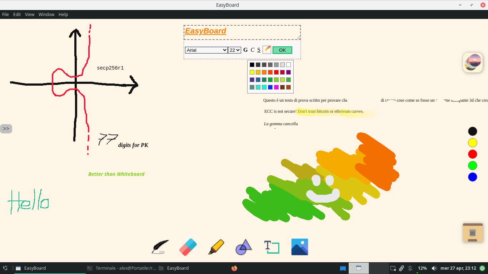

# EasyBoard

**An alternative to Microsoft Whiteboard**

This is a minimal whiteboard app created with ElectronJS. It has been created to be used in schools without need to log in like Microsoft Whiteboard request, without long loading times like smartnotebook does and with an easy interface opposite to OpenBoard.

<p align="center">

<p align="center"><i>Everithing is written in easyboard</i></p>
</p>

## Available functions

### The free and opensource version of this app implements:

- Free writing pen with multiple colors and size
- Eraser
- Highlighter
- TextBox (with multiple fonts, colors and style decorations)

### The payment version implements:

- Multiple layers
- Save and retrieve your work
- Geometries
- Insert images

## Future implementations

### Free version
- Insert Images
- Adaptive eraser when user move fast the cursor the eraser grow (DONE)

### Payment version

- Math Spirals
- Math Symbols

  ## Build instructions

### Install NodeJS
From nodejs official website you can download the LTS version <a href="https://nodejs.org/en/">https://nodejs.org/en/</a>

### Install electron
From terminal (CMD on Windows) give: `npm i -D electron@latest`

### Build
Inside the git downloaded folder give (1 at time):
```
npm install --save-dev @electron-forge/cli

npx electron-forge import

npm run make
```
You will find the binary in the out folder. You can use a software like <a href="http://angusj.com/resourcehacker/">ResourceHacker</a> to change the icon.

## License

BSD 3-Clause "New" or "Revised" License
A permissive license similar to the BSD 2-Clause License, but with a 3rd clause that prohibits others from using the name of the project or its contributors to promote derived products without written consent.
